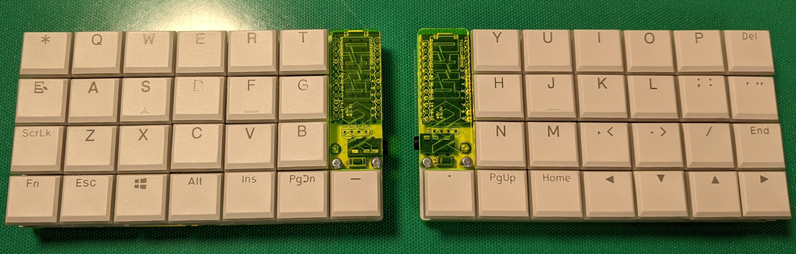
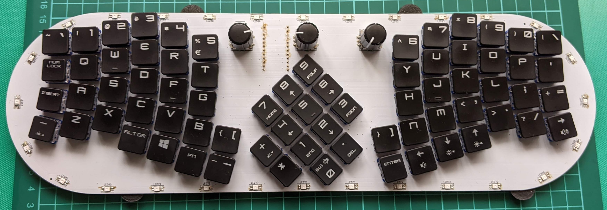
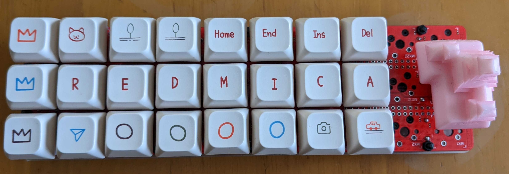
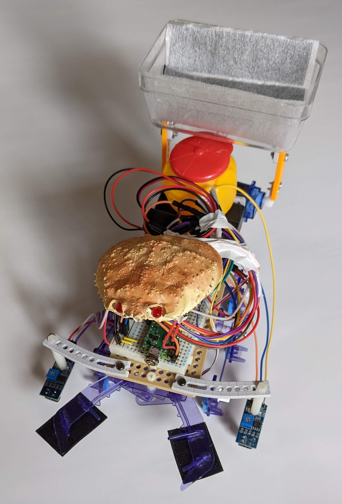
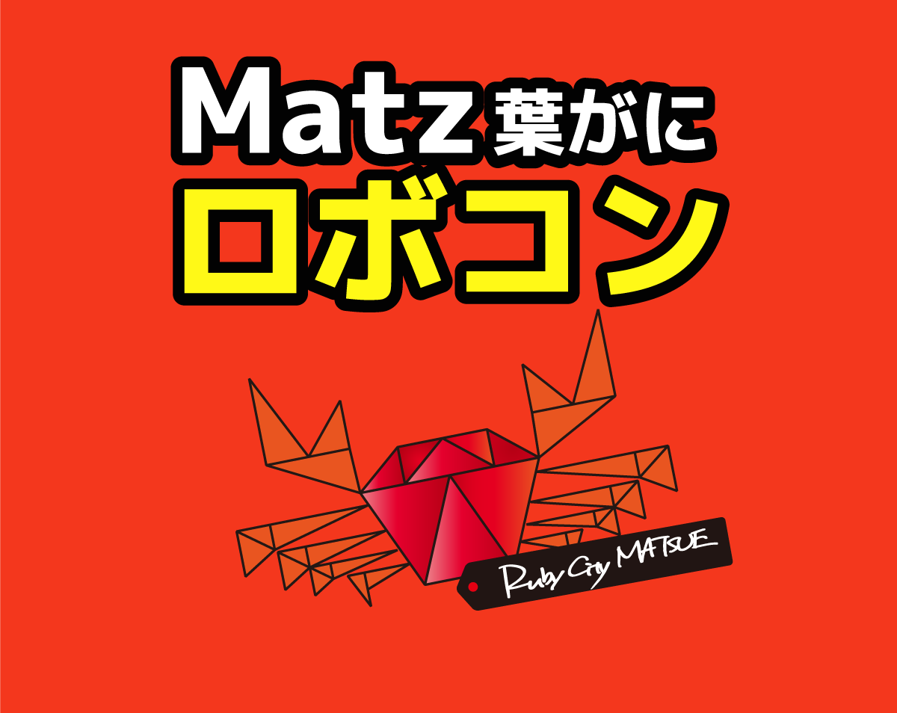
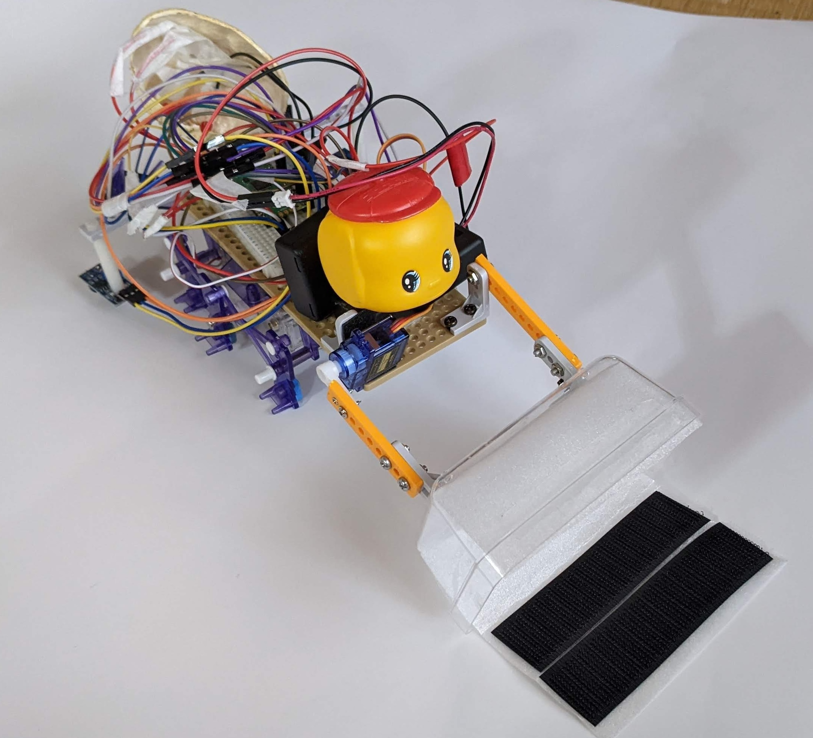

# キーボードからロボットへ

KeebWorld Conference 2024
2024-12-07
黒谷明大
@kurod1492

## 自己紹介

* 黒谷明大
* ファーエンドテクノロジー株式会社
* Redmineの解説記事
* 剣道
* Magic: The Gathering

## 自作キーボードを振り返る

自分で作ったキーボードを振り返ります

## (前置き）父親が突然買ってきたMZ-80K2E

* (小学4年生の感想)ずれてないキーボードはダサいなあ

## 10キーボードを自作

* 「バックアップ活用テクニック」
* ジャンク品10キーボードの回路図
* MSXのキーボードコントローラチップの回路図
* コントローラチップの足に直接はんだづけ
* 「信長の野望」が快適に遊べるのでは？

## 10キーボードを自作

* 基盤からキースイッチを（破壊的に）外す
* キースイッチの足をユニバーサル基板にのせる
* 回路図を見ながら足と足を空中配線で接続
* 「信長の野望」が快適に遊べるようになった！

## 後日

* 親にとても怒られた
* MZ-80K2Eは廃棄処分
* 申し訳ないことをした
* もったいないことをした
* でも、この経験は活きた

## Helix Pico

## Helix Pico

* 分割
* ロープロファイル
* ピコピコ
* ずれてないキーボードは最高です

## Oyamada Willow

## Oyamada Willow

* 分割キーボードのようなレイアウト
* マイコンは1個
* ずれてないキーボードは最高です

## PiPi Gherkin

## PiPi Gherkin

* KeebKaigi 2023
* 松本城（松江城でなく）
* ずれてないキーボードは最高です

## PRK Firmware

* Oyamada WillowとPiPi GherkinはPRK Firmwareで動作
* 変更が簡単
* 仕事中でもすぐに変更できる
* PRK Firmware 最高です

## R2P2

* RubyWorld Conference 2022
* 子どものプログラミング
* Lチカとかモーター動かすとかできそう？

## かにロボコン

## かにロボコン

* ライトレース競争
* 福井：福野さん「Ichigo Jam」
* 松江：松江高専・杉山先生「SmT」
* R2P2でも！

## ロボット作りました

## R2P2を使った開発サイクル

1. R2P2のシェル環境でプログラムを数行実行する
2. うまくいかない
3. シェルの履歴をたどってプログラムを直して実行する
4. うまくいったら、動いたプログラムをファイルにコピペして保存する

* R2P2 最高です

## Matz葉がにロボコン

## 第2回 Matz葉がにロボコン

* 2025年1月12日（日）10時～17時
* 松江テルサ 1F テルサホール
  * 小学生部門（3年生〜6年生）
  * オープン部門（中学生以上、大人もOK）
* 小学生向け講習会：12/15（日）＠ラボ
* https://www.shimane-oss.org/kani-robo/

## まとめ

* キーボード
* PRK Firmware
* R2P2
* ロボット
* 楽しい
* 楽しさを伝えたい
* Matz葉がにロボコン

## ご清聴ありがとうございました

